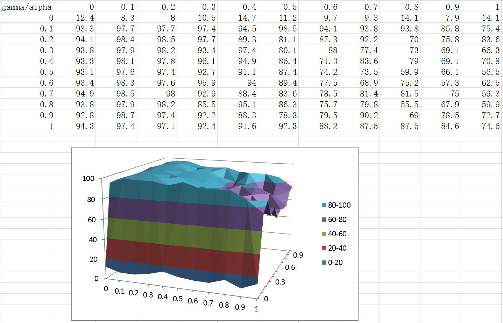
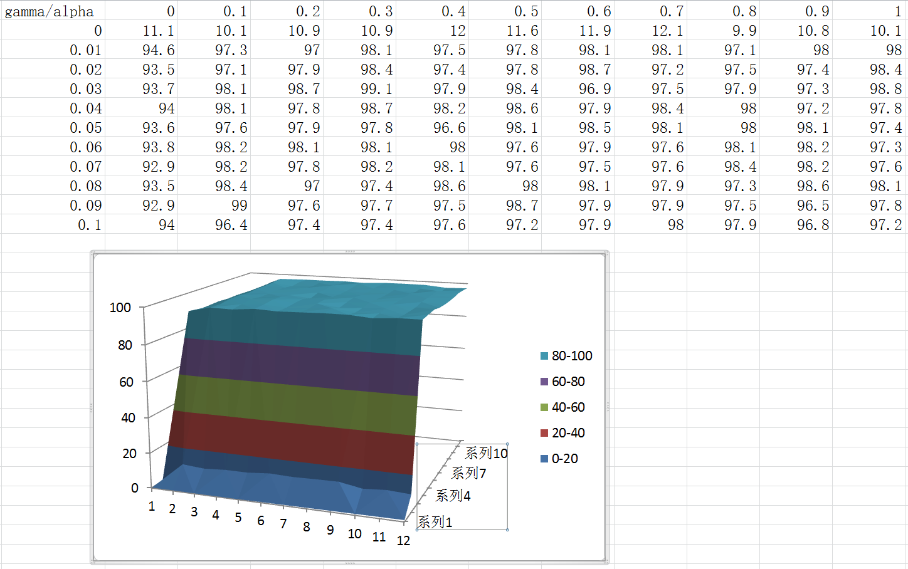
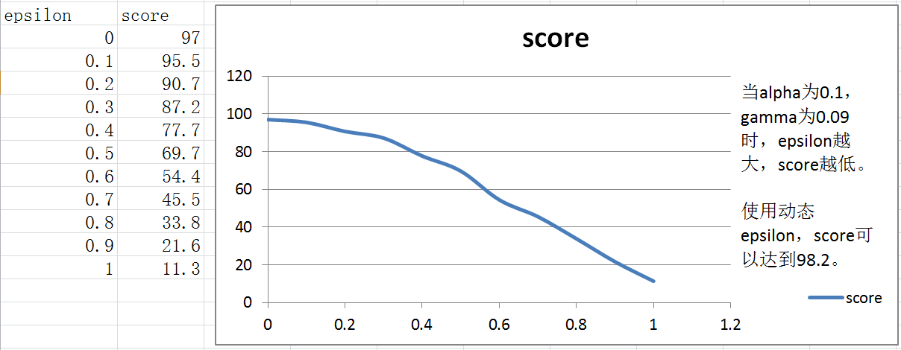

##Report

####实现基本的驾驶智能体

*问题: 在你的报告中，说明观察到的智能体的行为。它最终到达目标位置了吗？有什么其他值得注意的地方吗？*

Answer: 

由于智能体的行为是随机的，运气好的话，它是可以到达目标位置的，但是到达目标位置时一般都超过了deadline。如果deadline = -100时智能体还没有到达目标位置的话，就会尝试失败。

####Inform the Driving Agent

*QUESTION: What states have you identified that are appropriate for modeling the smartcab and environment? Why do you believe each of these states to be appropriate for this problem?*

Answer:

1. next_waypoint（下一路径点的位置）
2. light（信号灯的状态）
3. oncoming（前面车的行驶方向）
4. left（左边车的行驶方向）

next_waypoint是根据目标位置得到的，用于指示前进方向。

light，oncoming，left是为了不违反交通规则，不发生撞车事故。

没有选择right是因为右边的车不会对智能体产生影响，不需要考虑。

没有选择deadline是因为：

1. 对于到达目标位置而言时间足够充分
2. deadline对智能体做出决策并没有帮助
3. 我们不能因为时间紧迫而违反交通规则

*OPTIONAL: How many states in total exist for the smartcab in this environment? Does this number seem reasonable given that the goal of Q-Learning is to learn and make informed decisions about each state? Why or why not?*

Answer: 

在这个环境中一共有`3*2*4*4=96`个状态，对于Q-Learning来说是合理的。这些状态包含了所有可能会使智能体违反交通规则和发生撞车事故的情况。

####Implement a Q-Learning Driving Agent

*QUESTION: What changes do you notice in the agent's behavior when compared to the basic driving agent when random actions were always taken? Why is this behavior occurring?*

Answer:

智能体不再是随机的移动。经过学习以后，智能体能够不违反交通规则，不发生撞车，快速的到达目标位置。即使有deadline，对智能体来说也能轻松应对。这是因为我们设置的Qtable，并且根据智能体每一次的行为都对Qtable进行了更新。当智能体在某个位置出现了错误的行为或者去了错误的方向时都会被惩罚，经过几轮学习之后，智能体就能够自己规范行为并去向目标位置的方向。

####Improve the Q-Learning Driving Agent

*QUESTION: Report the different values for the parameters tuned in your basic implementation of Q-Learning. For which set of parameters does the agent perform best? How well does the final driving agent perform?*

Answer:

#### alpha gamma

我将alpha和gamma分别从0-1以0.1为间隔遍历了所有的值，并且以能够到达目标位置且净奖励为正作为评分标准，满分为100分，并且取10次评分平均值为最终评分。输出的表格如下图：

我们能看出在gamma不为0时成绩都比较好，但是gamma从0到0.1变化时成绩出现了突变，所以猜测最好成绩也有可能在0－0.1之间，于是我们对0-0.1之间又进行了评分，如下图：

在这个图表中我观察到gamma不等于0时，智能体的表现都是不错的，都在90分甚至95分以上，但是还是能找到表现最优的参数值alpha＝0.1，gamma＝0.09，此时分数为99分。并且我对每一个参数组合都进行了10次评分取平均值，所以这个结果是可信的，而不是偶然得出。
#### epsilon
在alpha＝0.1，gamma＝0.09的情况下对epsilon从0-1以0.1为间隔遍历了所有的值,仍然以能够到达目标位置且净奖励为正作为评分标准，满分为100分。输出的表格如下图：

我们能看出随着epsilon值升高，分数是下降的。但是直接取epsilon＝0或者0.1我认为还是不合适的。因为在最开始的时候epsilon的值应该大一些，智能体应该多尝试不同的情况以适应不同的环境。在训练次数小于60次的时候，`self.epsilon = (60 - self.ntrain) / 60`，同时epsilon的值不断减小，直到60次以后，epsilon ＝ 0.经过测试，这种动态epsilon的评分可以达到98.2分，比单纯的定值都要更好。

*QUESTION: Does your agent get close to finding an optimal policy, i.e. reach the destination in the minimum possible time, and not incur any penalties? How would you describe an optimal policy for this problem?*

Answer: 

在这个算法中，通过类似于 Grid Search 的方法来确定alpha，gamma的最优值，并且再次对epsilon进行了优化。

在程序中的智能体依据优化，已经可以顺利到达目的地，并且能够保证净奖励为正。对于这个智能体来说，最优策略应该是在不违反交通规则，不发生事故的前提下快速到达目标位置。

智能体在100次训练中没有办法完全学会最优策略，在行驶的过程中还有受到惩罚的可能。比如遇到直行来车左转，或左方来车直行这种情况的概率是非常低的，Qtable中这种状态下的4个action的值都为0，所以智能体在遇到这种情况时会随机做出选择，而这个随机的决定往往是错误的。并且智能体不能在一次惩罚中就完全学会应对这种状态。

我又对智能体进行了100000次测试，当训练次数达到10000次以上时，它被惩罚的概率低于0.1%，90000次以上时也仍然会受到一两次惩罚。

虽然100次的训练中智能体有了98%的成功率，但是并没有完全学会最优策略，即使成功率达到100%，也不能确定智能体学会了最优策略，因为它可能在到达目标位置的过程中受到惩罚。如果希望智能车能够在真实世界中安全出行，还需要智能体进行更大量的训练来学会应对所有可能的状况。